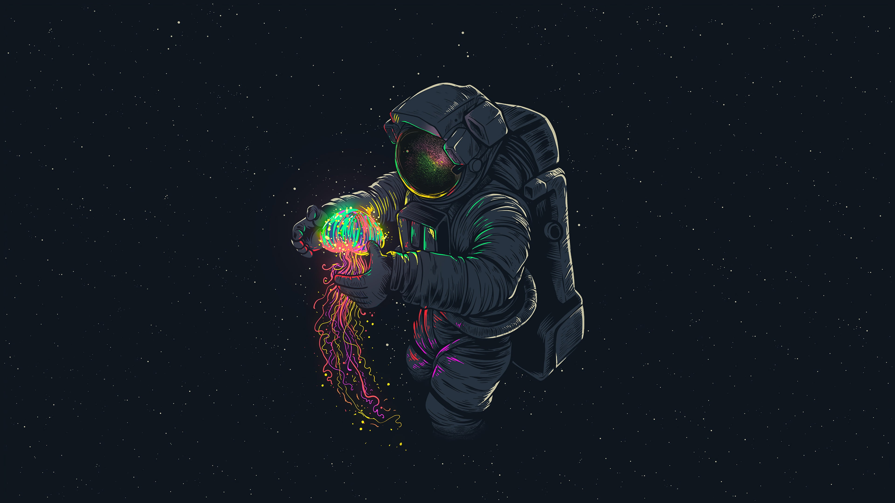

## 👋 Hello, I'm Dzikri Mursyid!

Enthusiastic coder on a quest for mastery, fueled by curiosity and driven by the thrill of web development challenges. While my major is in education, my heart beats for crafting powerful and functional websites. Currently, I'm on a mission to become a front-end web developer, and who knows, maybe even a full-stack wizard!

### 🚀 About Me

- 🎓 Studying at Jakarta State University, majoring in education.
- 💻 Passionate about web development and programming.
- 🌟 Currently learning React, Angular, and Vue.js, along with other languages like PHP.
- 📈 Striving to build practical projects and enhance my skills with each line of code written.

### 🛠️ My Projects

You can explore the results of my hard work and dedication in my [**scriptorium**](https://github.com/dzikriemursyid/scriptorium) repository. It's where I document my coding adventures, experiment with different technologies, and showcase my progress towards my web development goals.

### 🎨 My Portfolio

Visit my [portfolio](#) to see the projects I've worked on. From simple static websites to interactive web applications, I pour my heart and soul into every line of code. You might even find some fun mini-games to enjoy!

### 💬 Motivation

As someone who has always been fascinated by programming, I'm thrilled to finally embark on this journey. Learning programming languages isn't just a goal—it's a lifelong passion. With each line of code I write, I'm one step closer to turning my dreams into reality.

### Languages and Tools

.png).png).png).png)
